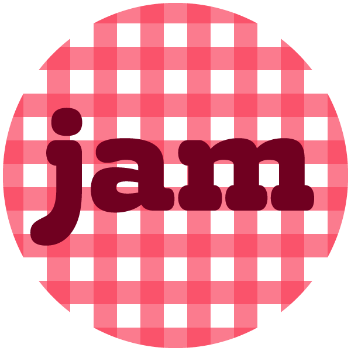

Jam is a CSS Flexbox based grid system for creating common page layouts with basic predefined responsive behaviours. It is intended to be simple enough for HTML beginners or CMS operators to understand. While it is not as comprehensive as some grid systems, it is surprisingly powerful.

Jam can be used to produce page layouts which you can easily build upon with the media query mixins included.

## User benefits

Intended to be easy for non-technical people to understand:

- Layout system based on varying span widths with uniform or irregular child column widths
- Easily produces common page layouts
- Layouts have basic responsive behaviours
- Pixels and percentages are the default units

## Customisation

Includes many Sass variables and mixins for custom grid generation, including:

- Maximum grid units span (default 18)
- Acceptable column variants array (default 2, 3, 4, 6 and of course 1 if class is not present)
- Media query breakpoints / maximum content width
- Media query mixins
- Responsive gutter widths and heights
- Optional Sass partial for typography

## Technical rationale

These other goals were important when developing Jam:

- Be easy to build upon
- Use as few classes as possible (eg columns are uniform width unless widths are specified)
- Allow non-column elements to span containers by default
- Be lightweight

## File size management

These steps have been taken to minimise file size:

- The Sass ouput contains as few @media blocks as possible
- There are almost no column positioning methods
