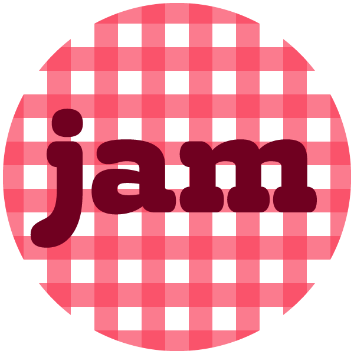

Jam is a CSS Flexbox based starter grid system, featuring content blocks of varying widths with basic predefined responsive behaviours. It is designed for use in CMSes and is simple enough for content editors and HTML beginners to understand. While it is not as comprehensive as some grid systems, you'll spend less time learning utility classes, setting up breakpoints, and overriding opinionated CSS.

Jam can be used to produce the underlying page layouts from which you can create your final designs, using your own code and the included Sass mixins.

## User benefits

Jam is designed to be easy for non-technical people to understand, either directly in the code or via a CMS:

- Allows you to create a stack of content blocks of varying widths aligned however you want, with uniform or irregular child column widths
- Easily produces contemporary layouts for landing pages and content pages
- Includes common responsive layout behaviours which can be easily customised
- The grid defines the outer sides of content blocks but does not force sub columns to adhere to it. It's always possible, if you know your CSS box-model well, to dial nested elements back into the grid
- The grid does not encourage the creation of nested grids, eg 18 new columns inside a column, because there's no aesthetic benefit to those / eww / learn flexbox
- Pixels and percentages are the default layout units because they are the easiest for beginners to understand

## CSS classes

You only need to know three classes to start using Jam:

- **.jam-jar** Apply this on a container element to define maximum width of the content using a Sass variable
- **.jam-span-*[n]*** Width of current element
- **.jam-cols-*[n]*** Defines how many columns the divs inside are arranged into

Jam has two very useful classes many web projects will use:

- **.jam-flip** *(Non-mobiles only)* Content HTML should be in order of appearance for mobiles, screen readers or search engines. Apply this on the same element as *.jam-cols-[n]* to reverse the column order (eg, show image on the right and text on the left) on larger screens
- **.jam-bleed** *(Mobiles only)* Apply this to a span to make it appear full-bleed (edge-to edge, left-to-right) on mobile

Jam lets you add padding at your discretion, because it can't predict where you'll need it. These all add padding equivalent to half the Sass variable you use for vertical gap, multiplied by [n]:

- **.jam-top-*[n]***
- **.jam-top-ph-*[n]*** *(Mobiles only)*
- **.jam-bottom-*[n]***
- **.jam-bottom-ph-*[n]*** *(Mobiles only)*

## Sass variables

- Maximum number of grid units in a spam (default: 18)
- Acceptable numbers of columns in a span (default: 2, 3, 4 , 6)
- Breakpoints and breakpoint sizes (default: phone, plus, tablet, standard, large)
- Horizontal and negative gap sizes (gutters) for each breakpoint
- Plus a few others

## Sass mixins

- jam-media($media)
- jam-gap-x($media, $modifier)
- jam-gap-y($media, $modifier)
- jam-unit($parent-span, $media, $modifier)

## Optional add-ons

- **Demo** An example web page which may help you learn more about Jam until I improve these docs
- **Jam Dev Tools** package, hold down 'g' to display layout grid overlay with div classes and id
- **Jam Type** Sass partial file, featuring rem-based starter typography (default 1.0rem = 10px on non-mobiles)

## Technical rationale

These other goals were important when developing Jam:

- Be easy to build upon
- Use as few classes as possible (eg columns are uniform width unless widths are specified)
- Make all classes and mixins easy to identify so you can update it or remove it from your project easily
- Merge consecutive spans together on mobile (Sass variable included)
- Allow non-div elements to span containers by default, so not every content element needs to be in a div
- Be lightweight

## File size management

These steps have been taken to minimise file size:

- The Sass ouput contains as few @media blocks as possible
- There are minimal classes and almost no positioning ones

## To-dos

- Replace the demo page copy
- Add explanations of mixins to Readme
- Move the dev-box media / width jQuery to Dev Tools
- Add illustrated 'how to use' section to Readme
- Add 'how to install' section to Readme
- Convert Dev Tools and demo page jQuery to vanilla JavaScript